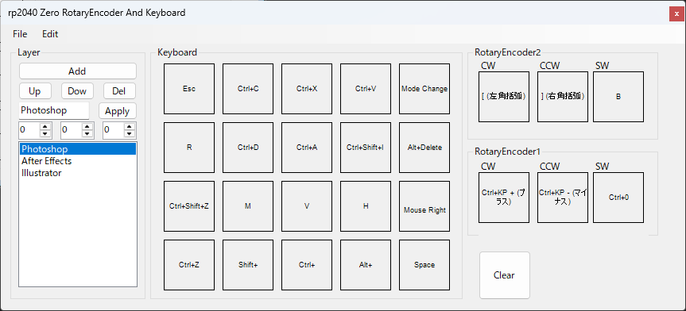

# RP2040 Zero Keyboard Configurator

RP2040 Zeroベースのカスタムキーボード用のキー割り当て設定ツール


対応ファームウェア: [rp2040Zero_keyboard_RotaryEncoder](https://github.com/bryful/rp2040Zero_keyboard_RotaryEncoder)


## 概要

このアプリケーションは、RP2040 Zeroマイコンを使用したカスタムキーボードのキー割り当てを視覚的に設定できるWindows向けコンフィギュレーターです。

### 主な機能

- **4×5キーマトリクスの設定**: 20個のキーボタン（4行×5列）を自由にカスタマイズ
- **ロータリーエンコーダー対応**: 2つのロータリーエンコーダー（CW/CCW/SW）の設定
- **最大8レイヤー対応**: 独立したレイヤーで異なるキー配置を保存（デフォルト3レイヤー、最大8レイヤー）
- **レイヤー管理**: レイヤーの追加・削除・コピー・名前変更に対応
- **LEDカラー設定**: レイヤーごとにRGB LEDカラーを設定可能
- **モディファイアキー**: Left/Right Ctrl、Shift、Alt、GUIキーの組み合わせに対応
- **マウス操作**: 左/右/中クリックの設定
- **シリアル通信**: デバイスへの設定送信・デバイスからの設定吸い出しに対応
- **ファイル保存/読み込み**:
  - バイナリ形式（`.dat`）
  - C++コード生成（クリップボードへコピー）
- **アプリ名プリセット**: Photoshop、After Effects、Illustrator、Premiere Proなどのレイヤー名プリセット

## 対応環境

- **OS**: Windows 10/11
- **ランタイム**: .NET 10.0
- **ターゲット**: RP2040ベースのカスタムキーボード

## インストール

### ビルド済みバイナリ（予定）

Releasesページから最新版をダウンロードしてください。

### ソースからビルド

**必要な環境:**
- Visual Studio 2026 以降
- .NET 10.0 SDK

**手順:**
```
git clone https://github.com/bryful/rp2040Zero_Keybord.git
cd rp2040Zero_Keybord
```
Visual Studioで `rp2040Zero_Keybord.sln` を開いてビルドしてください。

## 使い方

### 基本的な操作

1. **アプリケーションの起動**
   - `rp2040Zero_Keybord.exe`を実行
   - 前回の設定が `keyconfigs.dat` から自動ロードされます

2. **レイヤーの選択**
   - レイヤーナビゲーターで対象レイヤーを選択

3. **キーの設定**
   - キーボードマトリクスから設定したいキーをクリック
   - コンフィギュレーターでキーコード・モディファイア・マウスボタンを設定
   - 「Set」ボタンで適用、「Clear」ボタンでリセット

4. **ロータリーエンコーダーの設定**
   - CW（時計回り）、CCW（反時計回り）、SW（プッシュ）を個別に設定（2つのエンコーダー対応）

5. **保存と読み込み**
   - **自動保存**: アプリ終了時に`keyconfigs.dat`へ自動保存
   - **手動保存**: `File > Save`からバイナリ形式（`.dat`）で保存
   - **手動読み込み**: `File > Open`から`.dat`ファイルを読み込み
   - **C++出力**: `File > C++ to Clipboard`でファームウェア用コードをクリップボードへコピー

6. **デバイスとの通信**
   - `File > Get from Device`でシリアルポート経由でデバイスから設定を取得
   - シリアルポートの選択、DTR/RTS設定が可能

### C++コード出力形式

`File > C++ to Clipboard` で以下の形式のコードが生成されます：

```cpp
// Auto-generated key configuration
// Generated at: 2025-01-01 00:00:00

#define NUM_MODES 8
#define ENCODER_COUNT 2

KeyConfig keyMaps[NUM_MODES][4][5] = {
    {
        {{0, HID_KEY_A, NONE}, ...},
        ...
    },
    ...
};

KeyConfig encoderMaps[NUM_MODES][ENCODER_COUNT][3] = {
    {
        // Enc0  { CW, CCW, SW }
        {{0, HID_KEY_PAGE_UP, NONE}, {0, HID_KEY_PAGE_DOWN, NONE}, {0, HID_KEY_ENTER, NONE}},
        ...
    },
    ...
};
```

### キーコード対応表

- **HIDキーコード**: USB HID準拠（TinyUSB互換）
- **日本語キーボード**: JIS配列の特殊キー（無変換、変換、かな等）に対応
- **ファンクションキー**: F1?F24
- **メディアキー**: Mute、Volume Up/Down
- **マウスボタン**: Left / Right / Middle

### データ構造

各キーの設定は以下の3つのフィールドで構成されます：

| フィールド | 型 | 説明 |
|---|---|---|
| `modifier` | byte | モディファイアキー（ビットフラグ） |
| `keycode` | byte | HIDキーコード |
| `mouse` | ClickType | マウスボタン（NONE/MOUSE_L/MOUSE_R/MOUSE_M） |

## ライセンス

MIT License - 詳細は[LICENSE](LICENSE)ファイルを参照してください。

## 作者

[@bryful](https://github.com/bryful)


## 関連リンク

- [RP2040 Zero公式 (Waveshare)](https://www.waveshare.com/rp2040-zero.htm)
- [対応ファームウェア](https://github.com/bryful/rp2040Zero_keyboard_RotaryEncoder)
- [TinyUSB HID仕様](https://github.com/hathach/tinyusb)
- [USB HIDキーコード一覧](https://www.usb.org/sites/default/files/documents/hut1_12v2.pdf)

---

**Note**: このツールはキー設定のみを行います。RP2040ファームウェアは別途必要です。